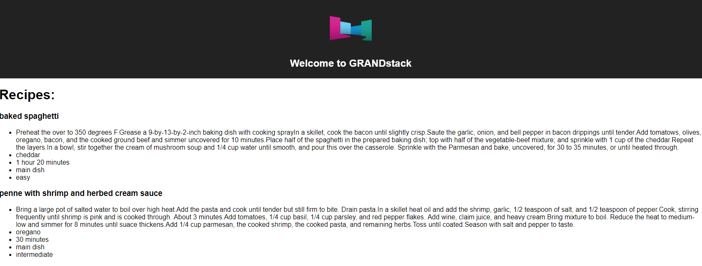
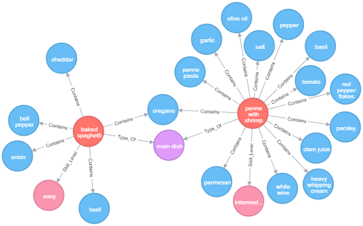

# RecipeSnapp - Based off the GRANDstack Starter

This project is a starter for building a [GRANDstack](https://grandstack.io) (GraphQL, React, Apollo, Neo4j Database) application. There are two components to the starter, the UI application (a React app) and the API app (GraphQL server).

## Quickstart

*Install dependencies*

```
(cd ./ui && npm install)
(cd ./api && npm install)
```

*Start API server*
```
cd ./api && npm start
```

This will start the GraphQL API in the foreground, so in another terminal session start the UI development server:

*Start UI server*
```
cd ./ui && npm start
```

## [`/api`](./api)


## [`/ui`](./ui)


# Useful Neo4j Queries

*Creating a new recipe*
```
CREATE (re:Recipe {name:toLower("Baked Spaghetti"), instructions:["Preheat the over to 350 degrees F.", "Grease a 9-by-13-by-2-inch baking dish with cooking spray","In a skillet, cook the bacon until slightly crisp.", "Saute the garlic, onion, and bell pepper in bacon drippings until tender.", "Add tomatows, olives, oregano, bacon, and the cooked ground beef and simmer uncovered for 10 minutes.", "Place half of the spaghetti in the prepared baking dish; top with half of the vegetable-beef mixture; and sprinkle with 1 cup of the cheddar.", "Repeat the layers.", "In a bowl, stir together the cream of mushroom soup and 1/4 cup water until smooth, and pour this over the casserole. Sprinkle with the Parmesan and bake, uncovered, for 30 to 35 minutes, or until heated through."], time: "1 hour 20 minutes"})
```
*Create new ingredient*
```
CREATE (i:Ingredient {name: toLower("Garlic")})
```
*Create unique constraint*
```
CREATE CONSTRAINT on (re:Ingredient) ASSERT re.name IS UNIQUE
```
*Create a new meal type*
```
CREATE (t:MealType {type: toLower("Dessert")})
```
*Return all recipes that are of a specified meal type and contain a specified ingredient*
```
MATCH (r:Recipe)
MATCH (r)-[:Contains]->(i:Ingredient{name:"beef"})
MATCH (r)-[:Type_Of]->(m:MealType{type:"main dish"})
RETURN r,i,m
```
*Match all recipes and relationships*
```
MATCH (r:Recipe)-[re]-(b)
return r,re,b
```


*Returns current database schema*
```
call graphql.schema()
```
*Creates quantity property on recipe->ingredient relationship*
```
MATCH (r:Recipe{name:"penne with shrimp and herbed cream sauce"}),(i:Ingredient{name:"parmesan"})
CREATE (r)-[c:Contains{quantity:"1/2 cup, grated"}]->(i)
RETURN r,i,c
```