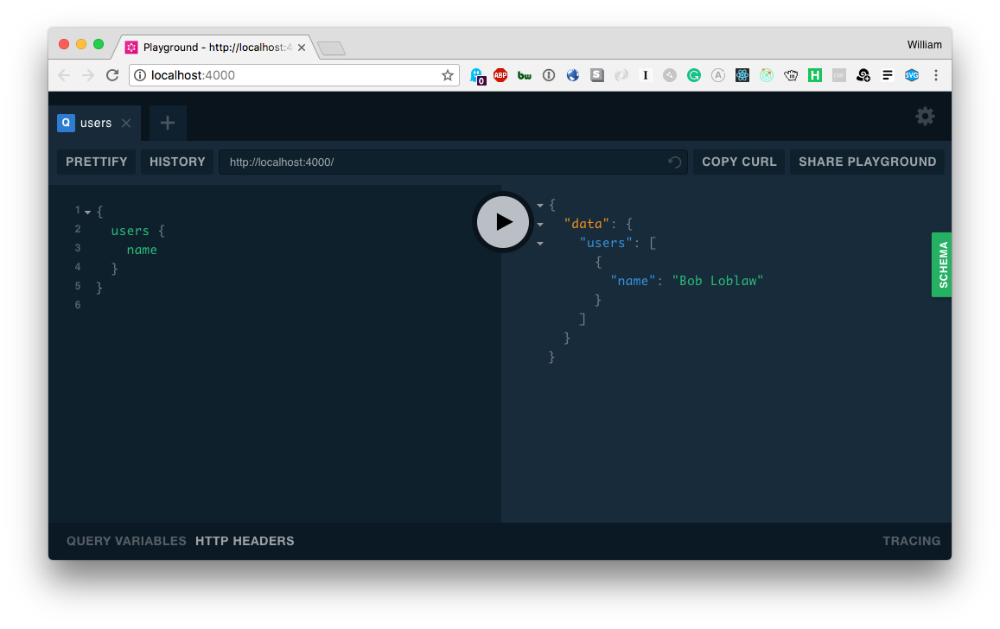

# GRANDstack Starter - GraphQL API


## Quick Start

Install dependencies:

```
npm install
```

Start the GraphQL service:

```
npm start
```

This will start the GraphQL service (by default on localhost:4000) where you can issue GraphQL requests or access GraphQL Playground in the browser:



## Configure

Set your Neo4j connection string and credentials in `.env`. For example:

*.env*

```
NEO4J_URI=bolt://localhost:7687
NEO4J_USER=neo4j
NEO4J_PASSWORD=letmein
```